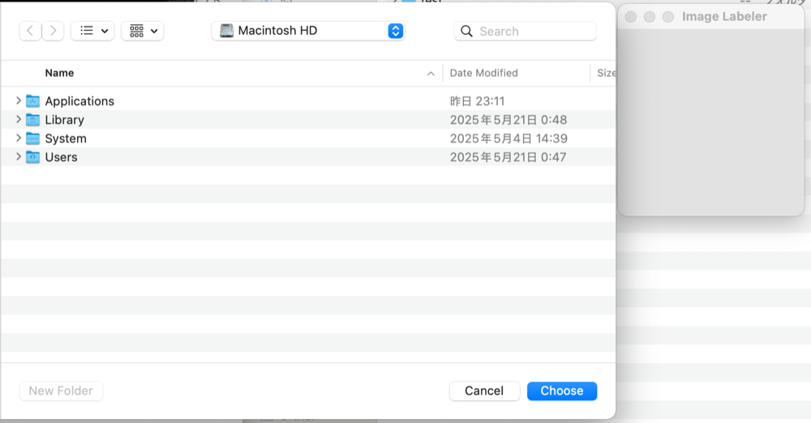
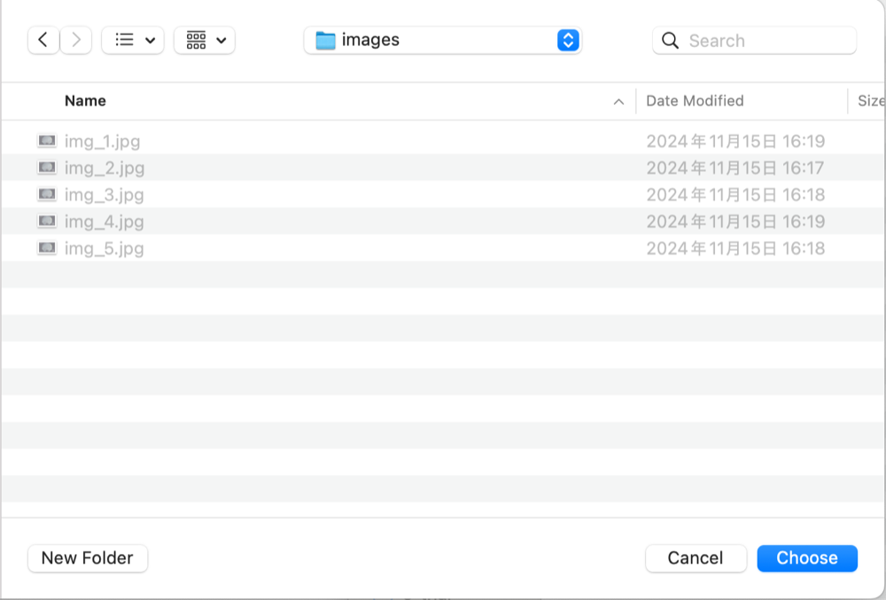
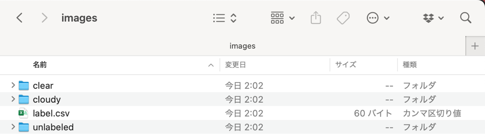
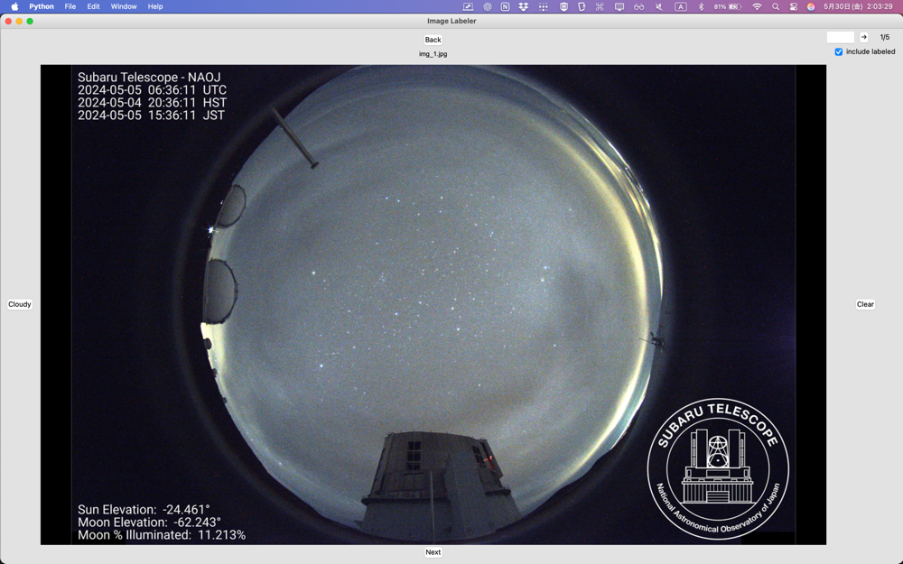
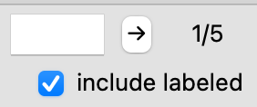
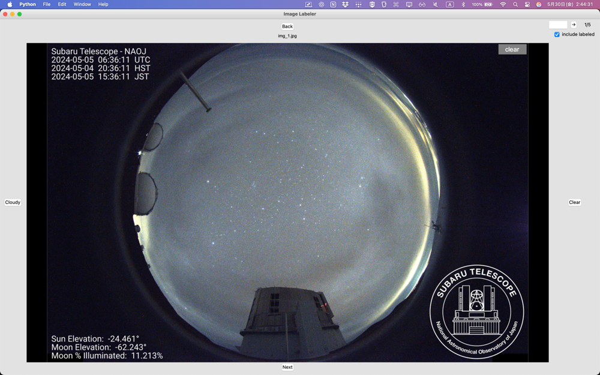
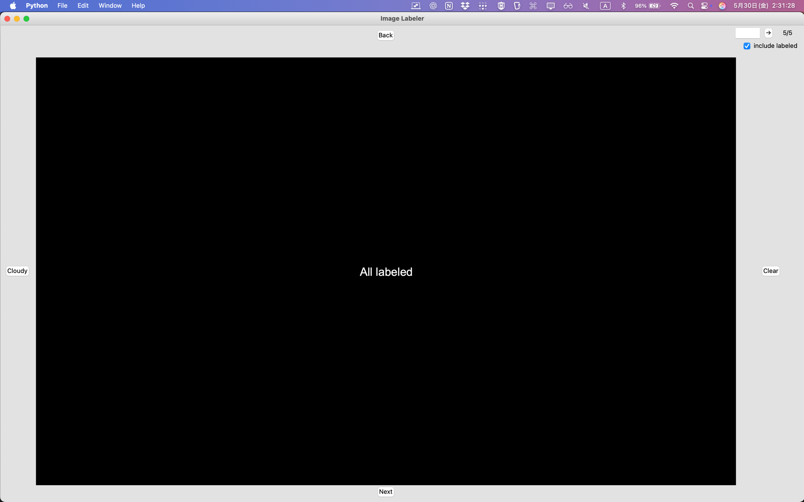

# Image Labeler

This app adds a label for an image and move it into the labeled directory. 

- 2 labels version


## Install

- Python
  https://www.python.org/downloads/

- PIL
  ```
  pip install pillow
  ```


## Files

```
src
├── _run.bat
├── _run.command
├── imageLabeler.py
└── settings.json
```


- `settings.json`

```json
{
  "data_path": "/path/to/your/image/directory",
  "csv": "label.csv",
  "unlabeled_dir": "unlabeled",
  "clear_dir": "clear",
  "cloudy_dir": "cloudy"
}
```

This settings file is changed automatically when this application is launched. 


- `_run.bat`: Run script for Windows

```bat
cd /d %~dp0
python imageLabeler.py
```


- `_run.command`: Run script for Mac

```bash
#!/bin/bash

set -CEuo pipefail
SCRIPT_DIR=$(cd $(dirname $0) && pwd)
#echo ${SCRIPT_DIR}
cd ${SCRIPT_DIR}

python3 imageLabeler.py
```


## Usage

### Run

You can run this application by these 2 ways as the below: 

- Run the below command on Terminal (Mac) or Command Promt (Windows)
  ```
  python imageLabeler.py
  ```

- Double click on the run script
  - `_run.bat`: Run script for Windows
  - `_run.command`: Run script for Mac


### Choose a data directory

When you launch this application firstly, you have to set the data directory manually. 
Please follow the directory dialog. 

#### Before choosing





```
images
├── img_1.jpg
├── img_2.jpg
├── img_3.jpg
├── img_4.jpg
└── img_5.jpg
```


#### After choosing

All images were moved into a **unlabeled** directory: 



```
images
├── clear
├── cloudy
├── label.csv
└── unlabeled
    ├── img_1.jpg
    ├── img_2.jpg
    ├── img_3.jpg
    ├── img_4.jpg
    └── img_5.jpg
```


Launched this app: 




### Labeling and other functions

You can add label with the following 2-ways, but I highly reccomend to use the keyboard shortcut!! :)

| Button | Keyboard Shortcut | Action                                                       |
| ------ | ----------------- | ------------------------------------------------------------ |
| Back   | ↑  **[Up]**       | Back to a previous image **WITHOUT** changing the labeling   |
| Next   | ↓  **[Down]**     | Go to a next image **WITHOUT** changing the labeling         |
| Cloudy | ← **[Left]**      | - Add a **Cloudy** label<br />- Move it from the unlabeled directory to the **cloudy** directory<br />- Go to a next image |
| Clear  | → **[Right]**     | - Add a **Clear** label<br />- Move it from the unlabeled directory to the **clear** directory<br />- Go to a next image |

- include labeled

  - [x] checked: manage all images including images that was already labeled

  - [ ] unchecked: manage unlabeled images only

- Jump
  - Jump to any image that you indicate when you set include labeled as **checked**




### Labeled

You can check the label on the upper-right position of the image (After labeling or **Cloudy**) when you go back to the file after the labeling. 




### After labeling




- Directories

```
images
├── clear
│   ├── img_1.jpg
│   ├── img_2.jpg
│   └── img_4.jpg
├── cloudy
│   ├── img_3.jpg
│   └── img_5.jpg
├── label.csv
└── unlabeled
```


- `label.csv`

```
img_1.jpg,clear
img_2.jpg,clear
img_3.jpg,cloudy
img_4.jpg,clear
img_5.jpg,cloudy
```


